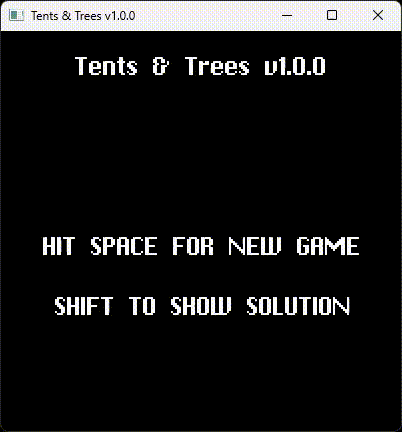

# Tents & Trees

Tents & Trees puzzle game written in 400 lines of c code.

## Game rules
Your job is to place tents (purple) next to trees (dark green).

Each tent is attached to one tree, there are as many tents as there are trees.

The numbers across the bottom and the right side tell you how many tents are in the respective row or column.

A tent can only be found horizontally or vertically adjacent to a tree.

Tents are never adjacent to each other, neither vertically, horizontally, nor diagonally.

A tree might be next to two tents, but is only connected to one.

## Controls
- **Escape**: Quit game
- **Shift**: Show solution
- **Left Mouse Button**: Use this to place a tent (purple).
- **Right Mouse Button**: Use this to place grass. This visually marks a field, indicating that a tent cannot be placed there. (This is just visually and has now effect game play wise) (light green)
- **Middle Mouse Button**: Use this to clear the contents of a cell. (white)

## Dependencies

Tents & Trees utilizes the **[kit](https://github.com/rxi/kit)** library, a
single-header graphics library.

Tents & Trees uses **kit** for:

- Window creation
- Rectangle drawing
- Text rendering
- Keyboard and mouse input handling

## Build Instructions

### Windows

- To build on Windows, run `build.bat`.
